# 🚀 ShrotiHost WhatsApp Manager for WHMCS


## 💬 Automate WhatsApp Communication in WHMCS — Effortlessly

**ShrotiHost WhatsApp Manager** is a powerful automation module that connects **WHMCS with WhatsApp (via Washroti)** — helping hosting businesses send real-time, professional notifications without manual effort.

From **invoice reminders and payment confirmations** to **ticket updates, service alerts, OTP verification, and bulk campaigns** — everything runs automatically from one centralized dashboard.

> ⚡ Reduce support load, improve payment recovery, and deliver instant communication — all inside WHMCS.

---

## 🔥 Why This Module Stands Out

* 📦 **105+ Ready-to-Use WhatsApp Templates** (plug & play)
* ⚡ Fully automated notifications for WHMCS events
* 📲 Built-in OTP system for phone verification
* 📢 Bulk campaigns with filters, scheduling & queue control
* 📄 Send real WHMCS PDF invoices directly on WhatsApp
* 📊 Smart dashboard with logs, insights & tracking

---

## ✨ Key Features

* Automated WhatsApp notifications for WHMCS email events
* Function-based alerts for admin & client activities
* Bulk WhatsApp campaigns with scheduling and queue control
* **105+ pre-built templates with merge-field support**
* PDF invoice delivery with real WHMCS invoice attachment
* OTP-based phone number verification system
* Detailed logs, queue manager, and campaign tracking
* Admin dashboard with analytics and status insights
* Mobile-friendly admin interface
* License-protected commercial module

---

## 🚀 What You Can Automate

### 💰 Billing & Invoices

* Invoice creation & reminders
* Overdue notices
* Payment confirmations
* Refund notifications

### 🎫 Support System

* Ticket opened / replied alerts
* Feedback requests
* Auto-close notifications

### 🖥 Service Lifecycle

* Service activation & welcome messages
* Suspension / unsuspension alerts
* Termination notifications

### 🔐 Security & Alerts

* OTP verification for clients
* Admin login alerts
* Client login & password change alerts

### 📣 Marketing & Bulk Messaging

* Send campaigns to filtered clients
* Import recipients via CSV
* Schedule and control message delivery

---

## 🧠 105+ Smart Templates Included

Start instantly with a rich library of pre-built templates:

* 💰 Invoice & Billing Templates
* 🎫 Support Ticket Templates
* 🖥 Service Notifications
* 🔐 OTP & Verification Messages
* 📢 Admin Alerts
* 📣 Bulk Campaign Templates
* ⚙ Function-Based Automation Templates

> ✨ No need to create messages from scratch — just customize and go live.

---

## 📸 Screenshots

## Info Dashboard

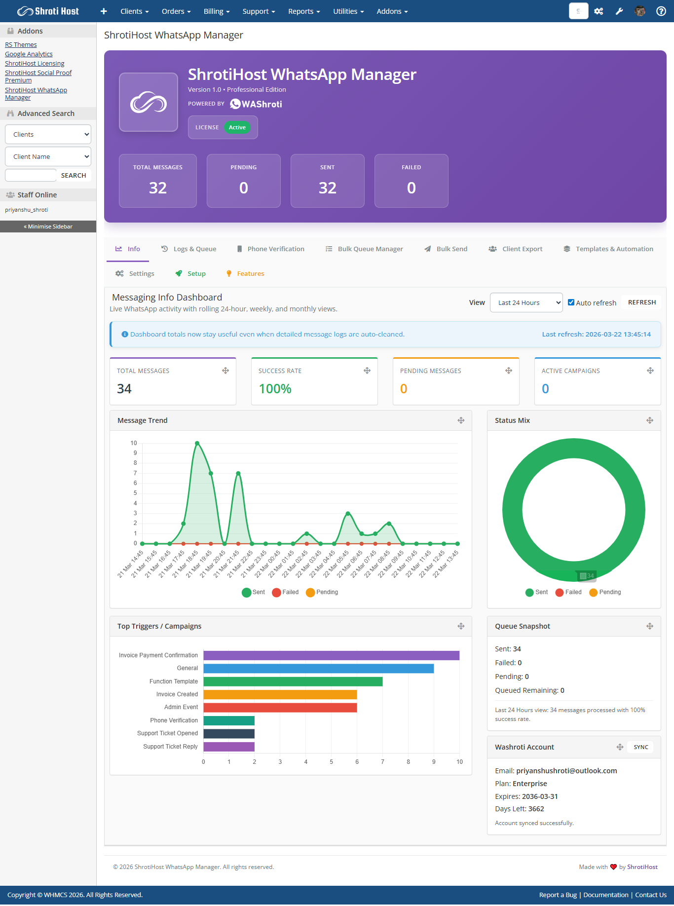

## Message Logs & Queue

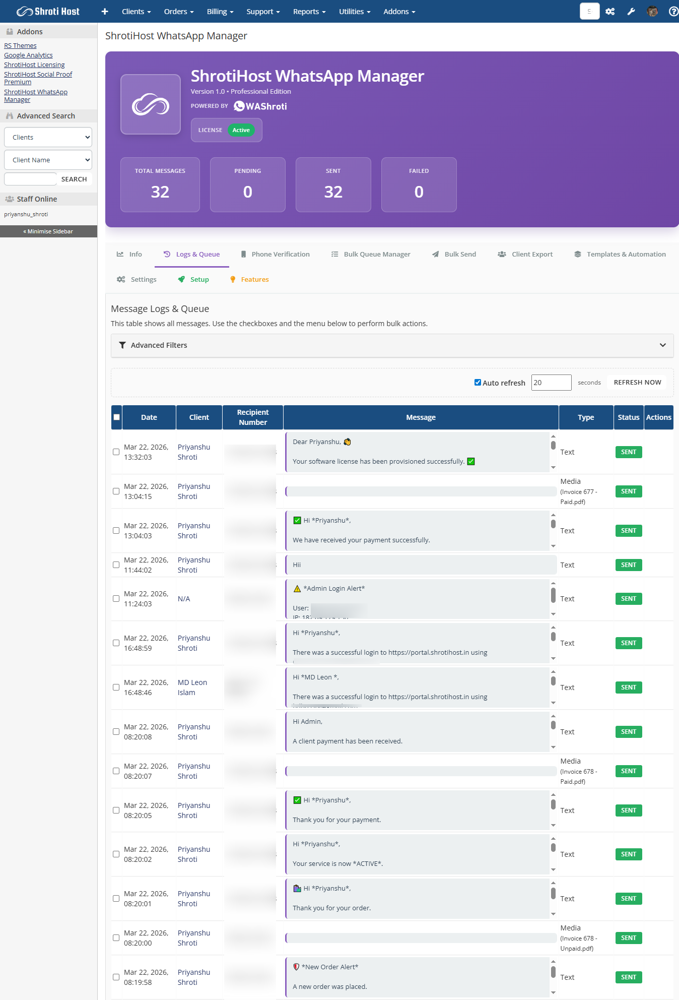

## Phone Verification Overview

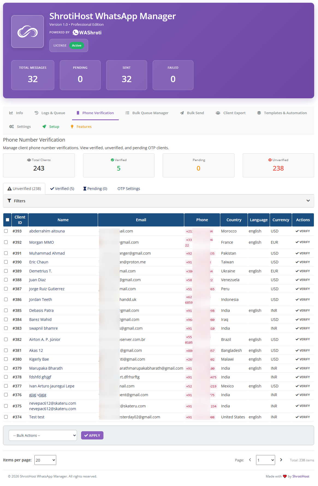

## Phone Verification OTP Settings

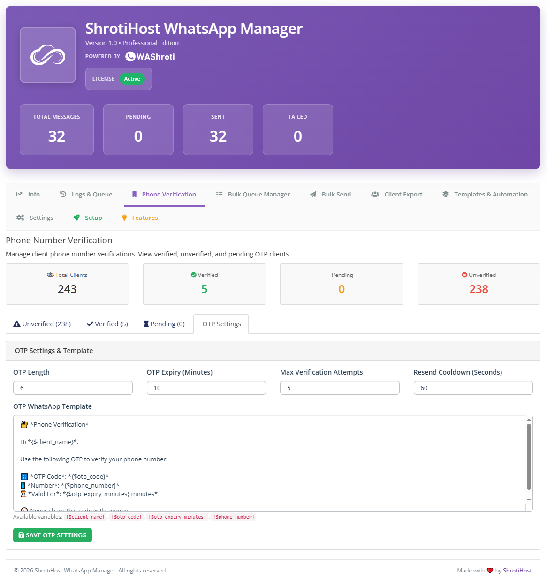

## Bulk Queue Manager

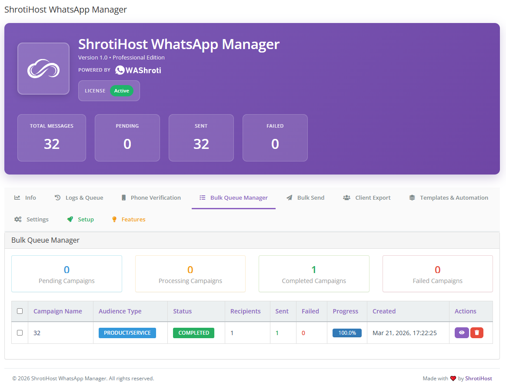

## Campaign Details

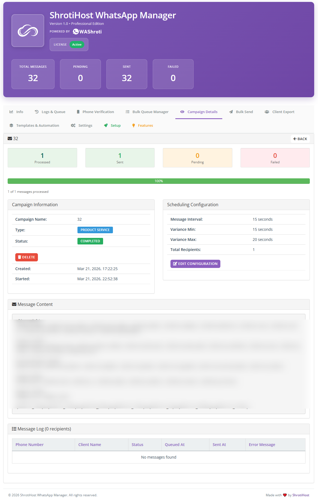

## Bulk Send Builder

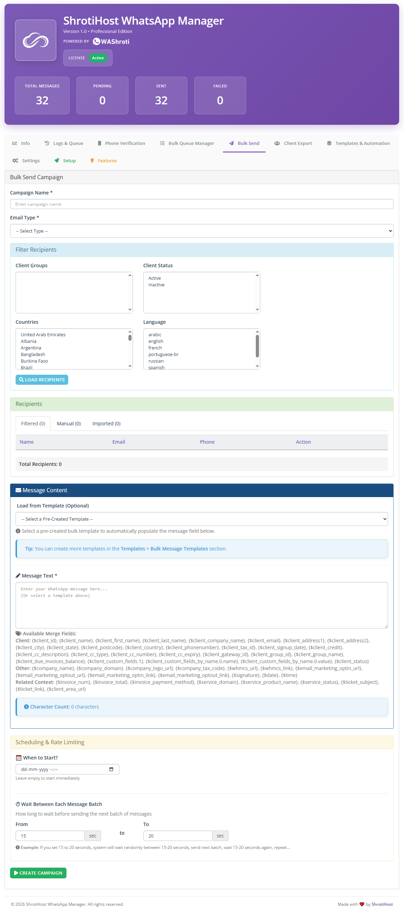

## Client Export

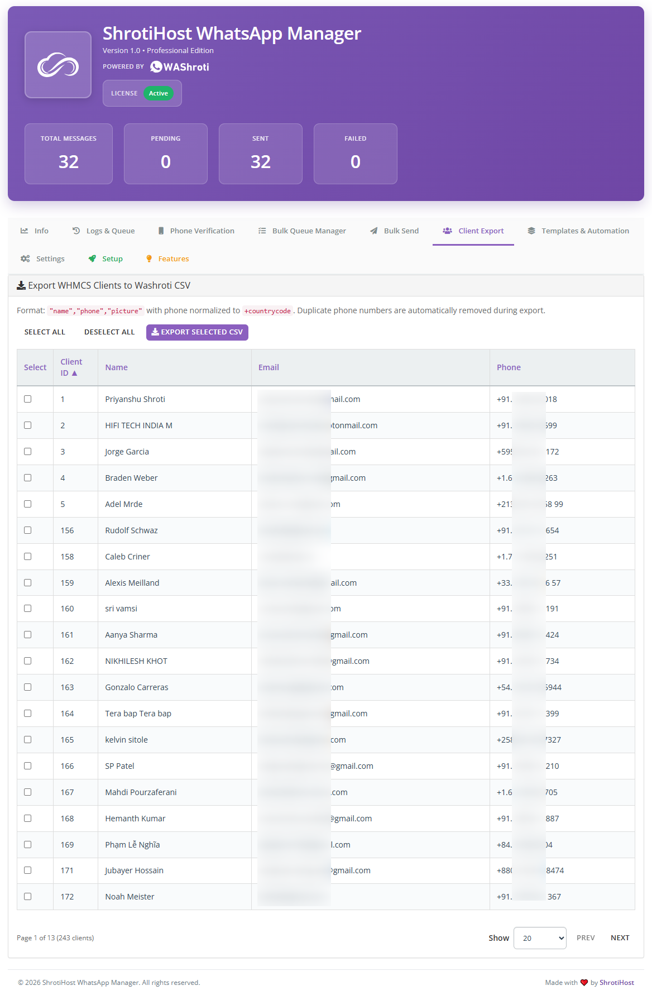

## Email Template Library

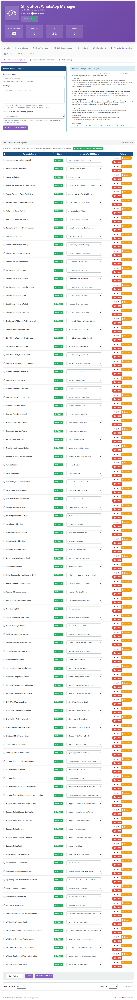

## Function Templates

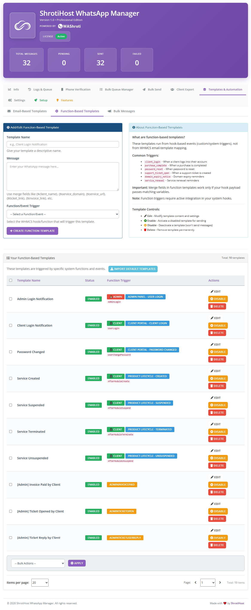

## Bulk Message Templates

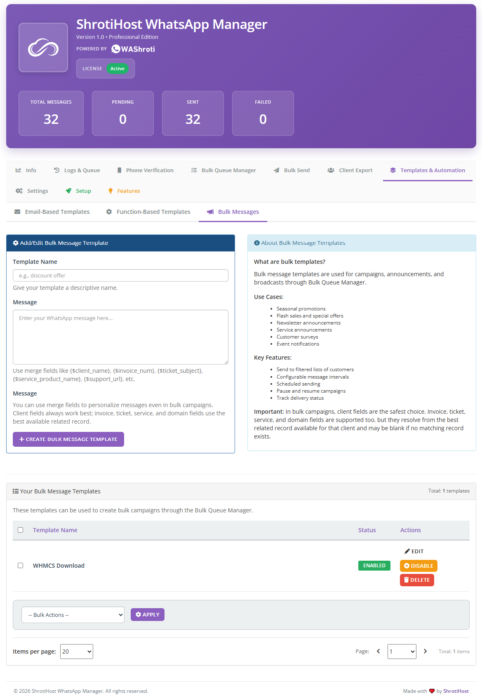

## Module Settings

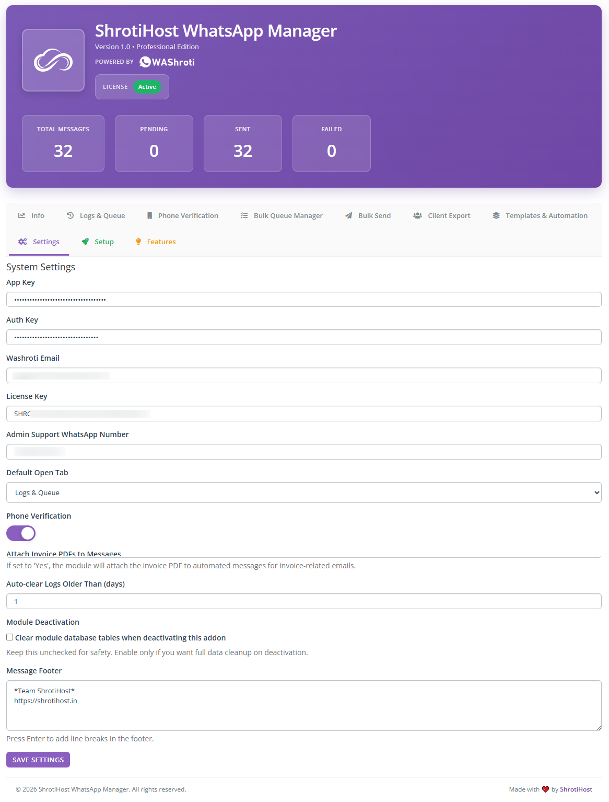

---

## ⚙ Requirements

* WHMCS Latest Version
* PHP 8.1 / 8.2 / 8.3
* IonCube Loader v14+
* MySQL/MariaDB with **utf8mb4** support
* Active commercial license key
* Valid Washroti account

For proper emoji support in WHMCS, add this line:

```php
$mysql_charset = 'utf8mb4';
```

---

## ⚡ Quick Setup (2 Minutes)

1. Upload module to:
   `/modules/addons/shrotihost_whatsapp/`

2. Activate from:
   `System Settings → Addon Modules`

3. Enter Washroti credentials:

   * License Key
   * App Key
   * Auth Key
   * Washroti Email

4. Import templates & enable automation

> 🚀 Start sending WhatsApp notifications instantly.

---

## 🧩 Module Areas

* **Dashboard** → Activity, insights, trends
* **Logs & Queue** → Track and manage messages
* **Phone Verification** → OTP system & clients
* **Bulk Send** → Campaign builder
* **Templates** → Manage all template types

---

## 🪄 Merge Field Support

Supports dynamic data from:

* Client details
* Invoice & payment data
* Services & domains
* Support tickets
* WHMCS URLs

Includes:

* Emojis 🎉
* Invoice links
* Ticket links
* Service details
* Payment methods
* PDF invoice delivery

---

## 🔒 Licensing

This is a **commercial module** and requires an active license.

Without activation:

* Features remain locked
* Messaging is restricted
* Module setup is incomplete

---

## 📱 Mobile Friendly

Fully optimized for:

* Desktop
* Tablet
* Mobile

---

## 🔗 Get the Module

https://portal.shrotihost.in/index.php/store/whatsapp-notification/shrotihost-whatsapp-manager-whmcs

---

## 🤝 Support

https://shrotihost.in

---

## ❤️ Built by ShrotiHost
